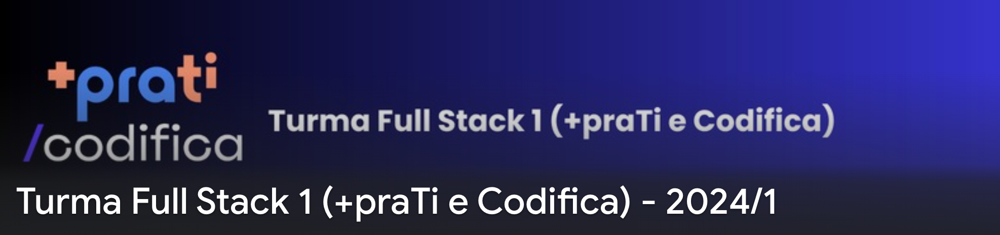

# [+praTI](https://www.maisprati.com.br/) e [Codifica](https://www.codificaedu.com.br/) - Curso Full Stack Jr.(2024)

Este repositório contém os materiais e atividades do curso de Desenvolvimento Full Stack Jr., oferecido pela parceria entre [+praTI](https://www.maisprati.com.br/) e [Codifica](https://www.codificaedu.com.br/). O curso é destinado a formar profissionais capacitados para enfrentar os desafios do mercado de tecnologia, com um enfoque prático e teórico abrangente.

## Estrutura do Repositório

#### Pasta Raiz:

- `/fullstack_+praTI`

#### Subpastas e Conteúdos:

- `/modulo01`
  - `/atividades`: Exercícios prático.
  - `/aulas`: Materiais didáticos.
- `/assets`
  - `Documento geral - curso - +praTI e Codifica • Desenvolvedor Full Stack Jr`: Documento com informações detalhadas sobre o curso, incluindo objetivos, metodologia, estrutura curricular e outras informações essenciais para os participantes.
  - `/img`

### Acesso aos Arquivos

Para acessar qualquer arquivo ou pasta, navegue utilizando a estrutura de pastas acima. Se você está procurando materiais específicos, como os exercícios de programação ou os slides das aulas, dirija-se à respectiva subpasta em `/modulo01`.

## Sobre o Curso

O curso busca proporcionar uma formação completa em desenvolvimento de software, abordando desde fundamentos de programação até técnicas avançadas em frameworks modernos. Os participantes irão desenvolver habilidades críticas em programação, design de sistemas, e gestão de projetos de software.

### Objetivo

Formar desenvolvedores de software prontos para contribuir significativamente no mercado de trabalho, capazes de desenvolver, testar e manter sistemas complexos, e preparados para inovações contínuas na área de tecnologia.

### Metodologia

- Aulas teóricas e práticas distribuídas em módulos.
- Projetos práticos ao final de cada módulo para aplicação do conhecimento adquirido.
- Desenvolvimento de um projeto final abrangente que simula um ambiente real de trabalho.

## Conteúdo

##### O Curso consiste em 9 módulos em andamento:

- Introdução à Logica de Programação
- Git e Github
- Fundamentos do Frontend
- Front-end com React
- Back-end com Java
- Banco de Dados com MySQL
- API´s e API´s REST com SpringBoot
- CI/CD
- Módulos Extras

## Contribuições

Contribuições são bem-vindas para melhorar os materiais do curso e exemplos de código. Para contribuir, crie um pull request ou abra uma issue para discussão.

Como alternativa, consulte a documentação do GitHub em [como criar uma solicitação pull](https://help.github.com/en/github/collaborating-with-issues-and-pull-requests/creating-a-pull-request).

## Licença

Este projeto está licenciado sob a Licença MIT - veja o arquivo `LICENSE.txt` para detalhes.

## Contato

Para mais informações, dúvidas ou sugestões, contate-nos.

### 🔗 Links

---

Desejo sucesso a todos em sua jornada de aprendizado!
